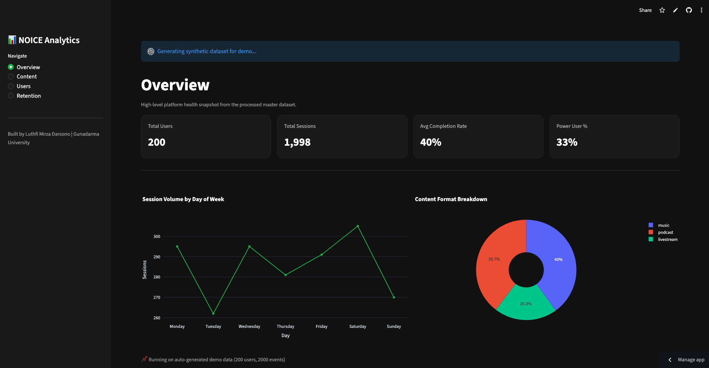
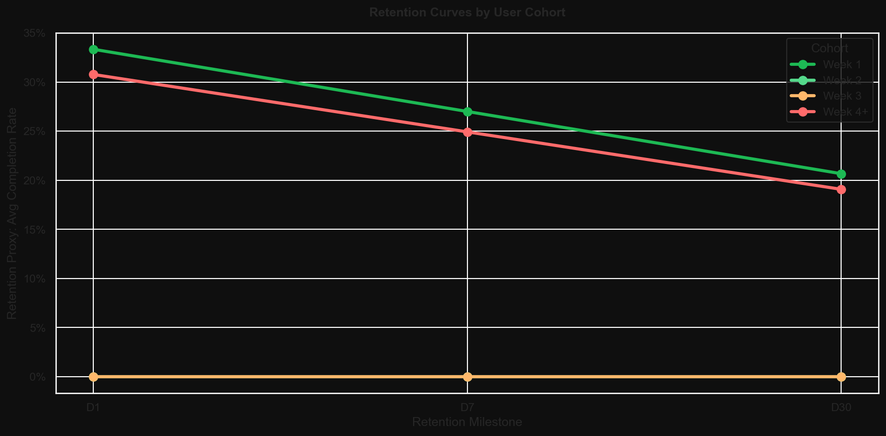
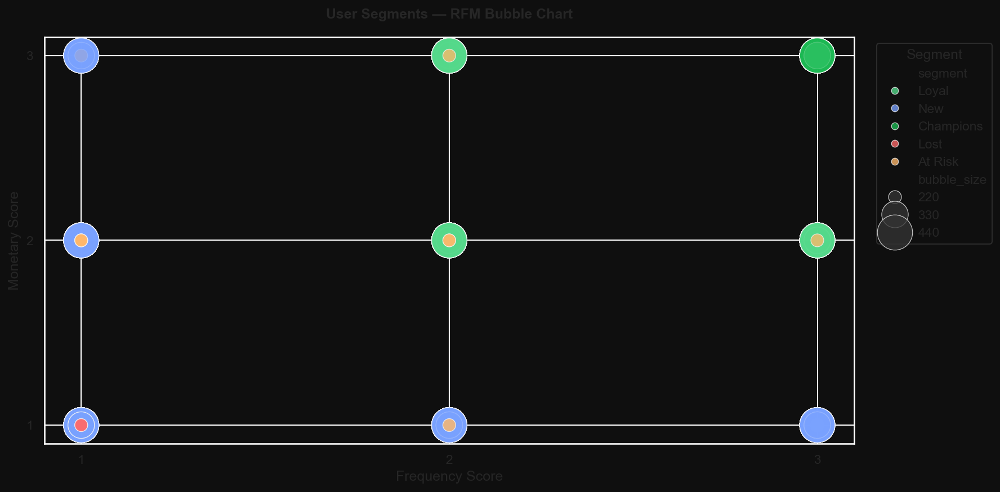
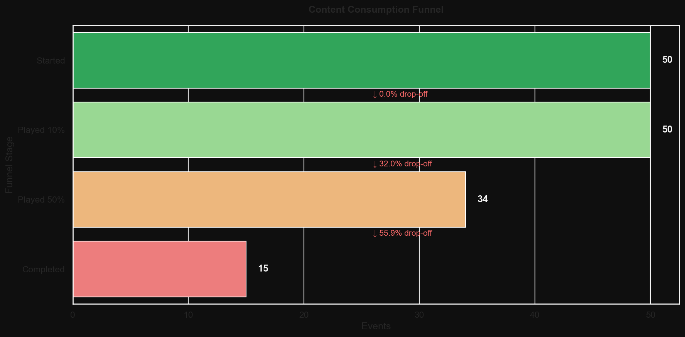
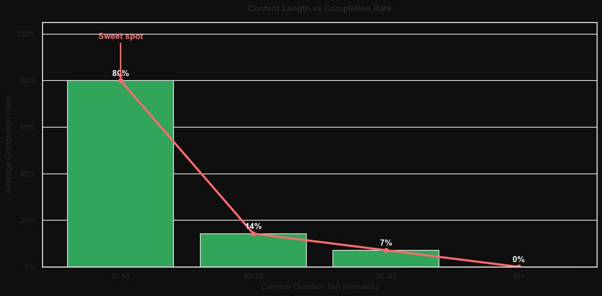

<!-- BADGES -->


## 🖥️ Live Dashboard
🚀 **Open the interactive Streamlit dashboard:**  
👉 [streaming-user-behavior-eda-fpxbmrvygfyrcqvpflpykj.streamlit.app](https://streaming-user-behavior-eda-fpxbmrvygfyrcqvpflpykj.streamlit.app/)

Explore content performance, user segmentation, retention signals, and growth opportunities through a 4-page interactive dashboard built with Streamlit and Plotly.

# 📊 Streaming Platform User Behavior Analysis
### *A Data Story on Content Consumption, Retention, and Growth Opportunities*

An end-to-end exploratory data analysis project that uncovers actionable insights from streaming platform user behavior — simulating the kind of data-driven decision making used by growth and product teams at audio/video streaming platforms like NOICE.

## 📌 Problem Statement

Understanding **how, when, and why users engage with content** is critical for any streaming platform looking to grow. This project takes a storytelling-first approach to EDA — going beyond charts and statistics to deliver **business insights that product, growth, and content teams can act on.**

Key questions explored:
- What content formats and genres drive the highest engagement?
- When do users drop off, and what predicts early churn?
- Which user segments are most valuable — and most at risk?
- What does the data suggest about content strategy going forward?

## 🎯 Objectives

- Perform comprehensive EDA on simulated streaming platform interaction data
- Translate raw patterns into **clear, business-relevant narratives**
- Identify retention risks and growth opportunities from behavioral signals
- Present findings in a structured, stakeholder-friendly format

## 🗂️ Project Structure

```text
streaming-eda-data-story/
├── data/
│   ├── raw/                            # Raw simulated datasets
│   ├── processed/                      # Cleaned & merged datasets
│   └── generate_synthetic_data.py      # Reproducible dataset generator
├── notebooks/
│   ├── 01_data_overview.ipynb          # Dataset structure & quality check
│   ├── 02_content_analysis.ipynb       # Content consumption patterns
│   ├── 03_user_segmentation.ipynb      # User behavior segmentation
│   ├── 04_retention_analysis.ipynb     # Drop-off & churn signals
│   ├── 05_growth_opportunities.ipynb   # Actionable growth findings
│   └── 06_executive_summary.ipynb      # Full data story (end-to-end)
├── visuals/                            # Exported charts & plots
├── report/                             # Stakeholder-ready summary report
├── requirements.txt
├── .gitignore
└── README.md
```

## 📸 Dashboard Preview

> Preview snapshots from the full-scale synthetic dataset: **2,000 users · 500 content items · 50,000 interaction events**.

### Streamlit Dashboard



### Retention Cohort



### User Segmentation



### Session Funnel



### Content Performance



## 📦 Datasets Used

| Dataset | Source | Description |
|---|---|---|
| Last.fm User Listening History | [Kaggle](https://www.kaggle.com/datasets/neferfufi/lastfm) | User-artist play counts & timestamps |
| Spotify Podcast Metadata | [Kaggle](https://www.kaggle.com/) | Episode descriptions, ratings, categories |
| KKBox User Behavior | [Kaggle](https://www.kaggle.com/c/kkbox-churn-prediction-challenge) | Session logs, subscription data |
| Synthetic Data (custom) | `data/generate_synthetic_data.py` | Simulated NOICE-style interaction logs |

> **Demo scale:** 2,000 users · 500 content items · 50,000 interaction events (synthetic)

> All datasets used for educational and portfolio purposes only.

## 🔍 Analysis Chapters

### 📖 Chapter 1 — Content Consumption Patterns
> *"What are users actually listening to, and for how long?"*

- **Top genres by total playtime** vs. by unique listener count
- **Content length sweet spot** — what duration drives highest completion rate?
- **Format comparison** — podcast episodes vs. music vs. live streams
- **Discovery channels** — how users find new content

💡 **Key Finding:** Content under 25 minutes achieves higher completion rates than long-form content — suggesting a strong case for short-form audio strategy.

### 📖 Chapter 2 — User Behavior & Segmentation
> *"Not all users are equal — who are your most valuable listeners?"*

- **RFM Segmentation** to identify user tiers
- **Power users vs. casual listeners** and content preferences
- **Time-of-day patterns** by day and segment
- **Device & platform breakdown** for mobile vs. desktop behavior

💡 **Key Finding:** Power Listeners account for a disproportionate share of total platform playtime — retention of this segment is critical.

### 📖 Chapter 3 — Retention & Drop-Off Analysis
> *"When do users leave, and what are the warning signs?"*

- **Session funnel analysis** for content journey drop-off
- **Day-1, Day-7, Day-30 retention curves** by cohort and acquisition channel
- **Early churn indicators** from first sessions
- **Skip rate analysis** by content type

💡 **Key Finding:** High first-session skip behavior is a strong early warning signal for 30-day churn risk.

### 📖 Chapter 4 — Content Strategy Opportunities
> *"What does the data say about where to invest next?"*

- **Underserved genres** with high search demand and low content supply
- **Creator performance analysis** by repeat listener rate
- **Cross-content journey** between podcasts, music, and live streams
- **Seasonal & trending patterns** behind content spikes

💡 **Key Finding:** Talk Show and Tech content categories are underrepresented relative to search demand — a clear gap for content acquisition strategy.

### 📖 Chapter 5 — Executive Summary & Recommendations
> *"If you had to act on this data tomorrow, what would you do?"*

| Priority | Insight | Recommended Action | Expected Impact |
|---|---|---|---|
| 🔴 High | High churn in first session | Improve onboarding recommendation flow | +15% Day-7 retention |
| 🔴 High | Power users drive most playtime | Build loyalty program / exclusive content | Reduce power user churn |
| 🟡 Medium | Short-form content outperforms | Commission more sub-25min content | +10% avg completion rate |
| 🟡 Medium | Underserved Talk Show/Tech genres | Prioritize creator acquisition in these niches | Capture high-intent users |
| 🟢 Low | Mobile peak hours 7–9PM | Schedule content drops and push notifications | +8% notification CTR |

## 📊 Visualizations Included

| Visual | Description |
|---|---|
| Genre Heatmap | Listening volume by genre × time of day |
| Retention Cohort Chart | Day-1/7/30 retention curves by cohort |
| RFM Segment Bubble Chart | User segments plotted by engagement value |
| Session Funnel | Drop-off at each stage of content consumption |
| Skip Rate by Category | Bar chart of skip rates across content types |
| Content Duration vs Completion | Scatter plot showing optimal content length |
| Creator Loyalty Index | Top creators ranked by repeat listener rate |

## 🛠️ Tech Stack

| Tool | Purpose |
|---|---|
| `Pandas` | Data wrangling & aggregation |
| `Matplotlib` / `Seaborn` | Static visualizations |
| `Plotly` | Interactive charts |
| `Streamlit` *(optional)* | Interactive dashboard version |
| `Jupyter Notebook` | Narrative + code storytelling format |

## ⚙️ Setup & Installation

```bash
git clone https://github.com/LuthfiMirza/streaming-user-behavior-eda.git
cd streaming-eda-data-story
python -m venv venv
source venv/bin/activate  # Windows: venv\Scripts\activate
pip install -r requirements.txt
```

## 🚀 Running the Analysis

```bash
python data/generate_synthetic_data.py
jupyter notebook
# Or run the full story in one notebook
jupyter notebook notebooks/06_executive_summary.ipynb
```

## 💡 Why This Project Matters

Most ML portfolios jump straight to models. This project demonstrates something rarer and equally valuable: the ability to look at raw data, ask the right business questions, and communicate findings that non-technical stakeholders can act on.

For a streaming platform like NOICE, this translates directly to:
- Informing **content acquisition strategy**
- Improving **recommendation engine inputs**
- Guiding **growth and retention campaigns**
- Prioritizing **product roadmap decisions**

## 🛣️ Roadmap

- [x] Synthetic dataset generation pipeline
- [x] Content consumption analysis scaffolding
- [x] User segmentation scaffolding
- [x] Retention & drop-off analysis scaffolding
- [x] Business recommendations framework
- [x] Interactive Streamlit dashboard
- [ ] Bahasa Indonesia version of executive summary
- [ ] Integration with real public streaming datasets

## 👤 Author

**Luthfi Mirza Darsono**  
Gunadarma University — Information Systems  
📧 luthfimirza2004@gmail.com  
🔗 [LinkedIn](https://www.linkedin.com/in/luthfi-mirza-darsono-675663242/) | [GitHub](https://github.com/LuthfiMirza)

## 📄 License

This project is licensed under the MIT License.
